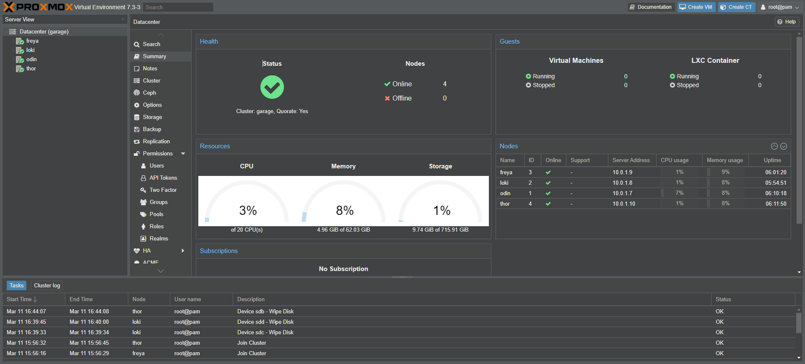

# Proxmox

Proxmox is like a Swiss Army Knife for computer nerds. It's a free, open-source software that lets you create and manage virtual machines (VMs) and containers on your own hardware. So instead of having to buy separate computers for each project or experiment, you can create multiple virtual machines on one physical computer.

This means you can experiment with different operating systems, software configurations, and network setups without worrying about messing up your main computer or having to buy new hardware every time. It's like having a playground for your computer, where you can try out different things and see what works best for you.

Proxmox has a web-based interface that's easy to use, so you don't have to be a computer wizard to get started. You can create, start, stop, and delete virtual machines with just a few clicks. You can also monitor their performance and resource usage, which is pretty cool.

Proxmox is also highly customizable and flexible, so you can use it in a lot of different ways. You can create a virtualized environment for gaming, web development, network testing, or just about anything else you can think of. Plus, it's free, so you don't have to worry about breaking the bank.

Overall, Proxmox is a really cool tool for computer geeks who want to experiment with different things and learn more about virtualization. It's like having a secret lab where you can play around with all kinds of technology without anyone else knowing. So if you're into that kind of thing, you should definitely check it out.

I use Proxmox to avoid having to physically go into my garage where I have most of my computing described in the [Hardware](hardware.md) section, this way I have a nice looking UI where I can provision VM's for any purpose that I need.

##
