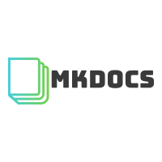

# rafaribe's Homelab

Welcome to my humble homelab.

This git repo is a place where I can experiment with new technologies and ideas. It's stored in a declarative `yaml` format, it's also the source of truth to my kubernetes clusters along with other homelab resources.

This repo utilizes [infrastructure as code](https://www.wikiwand.com/en/Infrastructure_as_code) practices and [GitOps](https://www.redhat.com/en/topics/devops/what-is-gitops) to declare the infrastructure present in my home.

This allows for a interesting workflow:

- Version control any changes allowing for easy refactors, rollbacks and tinkering.
- Easy disaster recovery as everything except persistent data is present in this repo.
- Try out interesting technologies and have that tracked on version control, allowing me to revisit them later even after deletion.

# Tech Stack

---

© All images are copyright to their respective owners and are protected under international copyright laws.
