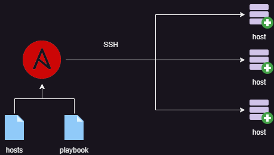

---
hide:
  - toc
---
# Ansible

Ansible is my go-to solution for provisioning hosts on both virtual machines and bare-metal machines. With Ansible, I can easily automate the installation of software, set up my preferred environment, and streamline the management of my applications.

One of the key benefits of using Ansible is the ability to automate software installation after booting up machines. This saves a considerable amount of time and effort, and allows me to focus on more important tasks.

In addition, I use Ansible to install my shell environment with customizations such as aliases. This is easily achieved through a playbook, and ensures that my shell is set up exactly how I like it.

When it comes to managing containers, Ansible is invaluable. I can provision and configure a bunch of containers on my backup-server with minimal effort, ensuring that my applications are deployed and managed seamlessly.

Overall, Ansible is a powerful and versatile tool that allows me to automate a wide range of tasks, from provisioning hosts to managing applications. It's an essential part of my toolkit as a system administrator, and helps me to stay productive and efficient.
